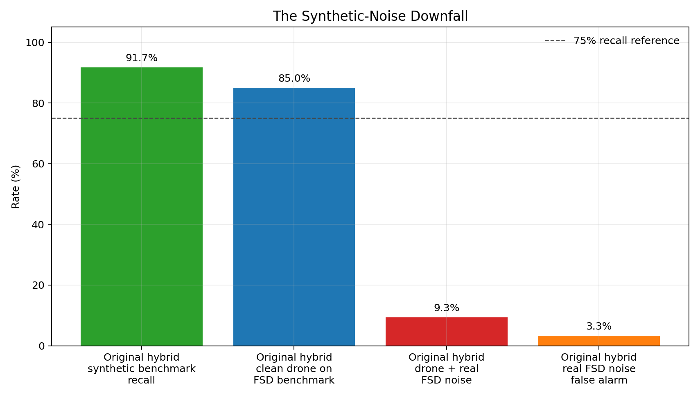
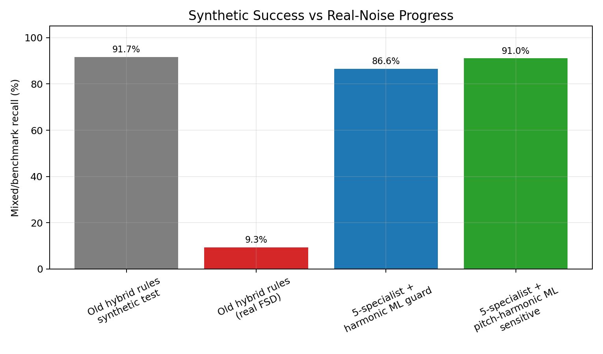

# Acoustic Drone Detection

Passive acoustic drone detection prototype built with Python, PyTorch, DSP, and real-noise benchmarking.

This repo is cleaned for portfolio review:

```text
code/             source code
results/graphs/   selected benchmark graphs
README.md         project story and results
```

No raw datasets, trained model weights, private recordings, or large generated outputs are included.

## Best Current Approach

```text
5-specialist CNN
+ harmonic DSP
+ pretrained pitch estimator
+ learned ML fusion
```

The system takes a 1-second audio window and decides:

```text
drone / no-drone
```

## Benchmark Snapshot

| Metric | Result |
|---|---:|
| Clean drone recall | 99.20% |
| Mixed drone + real FSD50K noise recall | 91.05% |
| Drone + FSD50K at -20 dB | 48.40% |
| Drone + FSD50K at -15 dB | 85.60% |
| Drone + FSD50K at -10 dB | 98.40% |
| Drone + FSD50K at -5 dB | 99.20% |
| False alarm rate on benchmark negatives | 0.00% |

These are benchmark results, not operational deployment claims. The next step is validation on real FPV drone recordings and real field noise.

## Why This Was Hard

Early versions looked good against synthetic tank and engine sounds. Then real FSD50K vehicle and engine recordings exposed the problem:

```text
synthetic noise success did not transfer to real noise
```

That failure became the main engineering lesson of the project.



## Trial and Error

| Step | Approach | Result | Lesson |
|---|---|---|---|
| 1 | Basic CNN on log-mel spectrograms | Learned drone/no-drone basics | Clean accuracy was not enough |
| 2 | One multi-view generalist CNN | Lower false alarms | Missed weak drones in noise |
| 3 | Five specialist CNNs | Higher sensitivity | One specialist could fire falsely |
| 4 | Rule-based hybrid | Strong on synthetic benchmark | Too conservative on real mixed noise |
| 5 | Real FSD50K hard negatives | Exposed real false-alarm problem | Synthetic noise was misleading |
| 6 | Real-noise generalist | Reduced false alarms | Lost mixed-drone recall |
| 7 | Balanced real-noise training | Better guard model | Still not enough alone |
| 8 | Harmonic DSP fusion | Added engine/vehicle structure features | Useful, but modest gain |
| 9 | Five real-noise specialists | Regained sensitivity | Needed better fusion |
| 10 | Pitch-harmonic learned fusion | Best benchmark balance | Needs real FPV validation |

Full story with graphs:

[Trial and Error Story](trial_and_error/README.md)

## How The Final System Works

```text
audio window
   |
   v
five filtered views
raw / HPF-150 / HPF-250 / BPF-200-6000 / BPF-500-6000
   |
   v
five specialist CNN probabilities
   |
   +--> harmonic DSP features
   |
   +--> pretrained pitch / periodicity features
   |
   v
learned ML fusion
   |
   v
final drone probability
```

### Five Specialist CNNs

Each CNN sees only one filtered view of the same audio window.

| View | Purpose |
|---|---|
| Raw | Preserve full signal |
| HPF-150 | Reduce deep rumble |
| HPF-250 | Stronger low-frequency rejection |
| BPF-200-6000 | Main drone-relevant band |
| BPF-500-6000 | Higher motor/propeller evidence |

### Harmonic DSP

Vehicle and engine sounds often create harmonic ladders:

```text
f0, 2f0, 3f0, 4f0...
```


The DSP stage estimates harmonic features such as fundamental frequency, harmonicity, low-band energy, and vehicle-risk score.

### Pretrained Pitch Estimator

A pretrained pitch/periodicity model adds features such as pitch confidence, pitch stability, and low-pitch ratio.

### Learned ML Fusion

The fusion model receives:

- five CNN probabilities,
- weighted specialist score,
- filtered maximum,
- vote count,
- harmonic DSP features,
- pretrained pitch features.

It learns the final drone probability instead of relying only on hand-written rules.

## Main Graphs

### Recall vs False Alarm


### Score Index


### Recall Across SNR


### Synthetic vs Real-Noise Progress



## Repo Structure

```text
code/
  src/       main Python/MATLAB source modules
  scripts/   older training and comparison scripts
  tools/     helper scripts

results/
  graphs/    selected figures only

requirements.txt
README.md
```

## Code Map

| Path | Purpose |
|---|---|
| `code/src/phase2v5_real_noise/` | Real-noise generalist CNN |
| `code/src/phase2_harmonic_fusion/` | Harmonic DSP + CNN latent fusion |
| `code/src/phase2b_pitch_guard/` | Pretrained pitch features + learned fusion |
| `code/src/phase3_real_noise_specialists/` | Five-specialist CNN ensemble |
| `code/src/phase3_array/` | Passive array / beamforming simulation |
| `code/src/fsd50k_hard_negative_eval/` | Real-noise benchmark tools |

## How AI Helped

AI was used as an engineering assistant for:

- brainstorming model architectures,
- generating and refactoring code,
- designing benchmark scripts,
- debugging failed iterations,
- creating graphs,
- writing clear project explanations.

The measured results came from local experiments and benchmark scripts. AI helped speed up the engineering process; it did not replace testing.

## Setup

```bash
python -m venv .venv
.venv\Scripts\activate
pip install -r requirements.txt
```

For module commands, set the package path:

```powershell
$env:PYTHONPATH="code"
```

Example:

```powershell
python -m src.phase3_real_noise_specialists.plot_iteration_comparison
```

## Not Included

The repo intentionally excludes:

- raw DADS audio,
- raw FSD50K audio,
- trained model checkpoints,
- private recordings,
- generated feature caches,
- full benchmark logs.

This keeps the GitHub project readable, lightweight, and suitable for a portfolio.
