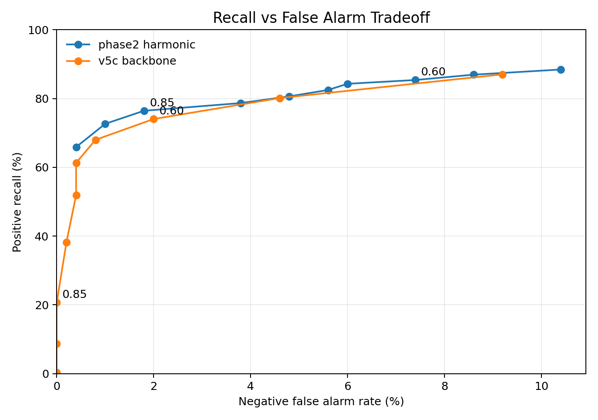

# Engineering White Paper: Acoustic Drone Detection Development

Project root: `E:\drone_detect`  
Date: 2026-05-17  
Status: engineering research prototype, not yet mission-validated

## Executive Summary

This project developed a passive acoustic drone detection system for the DADS dataset and then stress-tested it against real-world vehicle and engine noise. The system evolved from a single CNN baseline into a multi-view detector, a 5-specialist ensemble, a hybrid fusion system, a real-noise trained generalist, and finally a harmonic-feature fusion model.

The most important engineering lesson was that synthetic tank/engine noise produced misleading confidence. The early hybrid system looked excellent on synthetic tank/engine/crowd tests, including near-zero tank and engine false alarms, but it collapsed when tested against real FSD50K vehicle/engine recordings. This exposed a synthetic-to-real gap: the model had learned the project synthetic noise distribution more than the real operational nuisance class.

The current best experimental direction is not a single model. It is a layered detector:

1. A sensitive drone detector for recall.
2. A conservative generalist guard trained on real FSD50K noise.
3. A harmonic/DSP fusion head to help separate drone evidence from engine/vehicle harmonic structure.
4. Temporal smoothing and, later, microphone-array beamforming for spatial confirmation.

Current Phase 2 harmonic fusion improved real-noise mixed-drone recall over the v5c backbone while keeping false alarms around the same level.

## Mission Context

The target mission is passive acoustic detection of drones, especially FPV-style drones in noisy environments. Desired properties:

- Detect drone presence from audio windows.
- Remain robust against tank, engine, vehicle, crowd, wind, and speech false alarms.
- Eventually support microphone-array direction finding.
- Avoid active transmission. Beamforming is passive receive-only.
- Preserve older working models and experiments for comparison.

The project uses 1-second audio windows at 16 kHz unless otherwise stated. This means the current acoustic bandwidth is limited to approximately 0-8 kHz by Nyquist. True high-pitch FPV evaluation will require real FPV recordings and likely a later 48 kHz phase.

## Label Convention

The binary classifier convention used throughout the Python/PyTorch work:

| Class index | Meaning |
|---:|---|
| 0 | drone |
| 1 | no_drone |

Positive examples include drone alone and drone mixed with interference. Negative examples include tank, engine, crowd, speech, wind, pure noise, and vehicle/engine recordings without drone.

## Core Audio Representation

The project standardized around five spectral views of each 1-second waveform:

| View | Name | Filter |
|---:|---|---|
| 0 | raw | no filter |
| 1 | HPF-150 | 4th-order high-pass at 150 Hz |
| 2 | HPF-250 | 4th-order high-pass at 250 Hz |
| 3 | BPF-200-6k | 4th-order band-pass 200-6000 Hz |
| 4 | BPF-500-6k | 4th-order band-pass 500-6000 Hz |

The standard inference weights used in multi-view scoring:

```text
raw      0.05
HPF-150  0.20
HPF-250  0.25
BPF-200  0.35
BPF-500  0.15
```

The base CNN architecture remained intentionally small:

- Conv2d 1 to 16, batch norm, ReLU, max pool
- Conv2d 16 to 32, batch norm, ReLU, max pool
- Conv2d 32 to 64, batch norm, ReLU
- Adaptive average pool
- Linear classifier

This kept experiments fast and made failures easier to interpret.

## Development Timeline

### Phase 1 Baseline

Initial files:

- `models/drone_cnn_phase1.pth`
- `models/drone_cnn_phase1b.pth`

Purpose:

- Establish a simple supervised CNN baseline on log-mel spectrograms.
- Prove the DADS dataset could support binary drone/no-drone classification.

How it worked technically:

- WAV files were loaded as mono audio at 16 kHz.
- The audio stream was cut into 1-second windows with overlap.
- Each window was converted into a 64-bin log-mel spectrogram.
- The CNN treated the spectrogram as a 2D image with one channel.
- The classifier output two logits: drone and no-drone.
- The drone probability came from softmax over those logits.

Limitations:

- Not robust enough against hard negatives.
- No multi-view spectral filtering.
- Limited insight into tank/engine false alarms.

Iteration evidence:


The follow-up baseline improved the first model, but still remained a conventional single-view detector.


### Phase 2v2 Multi-View Direction

File:

- `models/drone_cnn_phase2v2.pth`

Purpose:

- Introduce multiple spectral views.
- Use preprocessing to reduce low-frequency clutter.

How it worked technically:

- Each audio window was converted into several filtered versions before spectrogram extraction.
- High-pass views reduced low-frequency tank/engine rumble.
- Band-pass views focused the CNN on the drone-relevant mid/high band.
- The same compact CNN architecture was kept so changes were caused mainly by preprocessing and data recipe, not by model size.
- Evaluation compared detection under different SNR levels to expose where the detector failed.

This established that filtered views mattered, but the system still needed better hard-negative handling.

Iteration evidence:


### Phase 2v3: Multi-View Generalist CNN

File:

- `models/drone_cnn_phase2_v3_multiview_hardnegatives.pth`

Architecture:

```text
audio window
-> create five audio views
-> during training, randomly select one view
-> one CNN learns all views through filter augmentation
-> during inference, run all five views
-> weighted score and voting rule
```

How it worked technically:

- Five audio projections were generated for every window: raw, HPF-150, HPF-250, BPF-200-6000, and BPF-500-6000.
- During training, the dataset randomly chose one of those five projections each time a sample was drawn.
- This acted like filter augmentation: the CNN saw the same label through different spectral views.
- During inference, the window was passed through all five views.
- The model produced five drone probabilities, one per view.
- The final decision used a weighted score, filtered-view maximum, and vote count.

This became the stable multi-view generalist CNN. It had low false alarms and was reliable, but it was less sensitive than later specialist models.

Reported prior result:

- 92.12 percent test accuracy
- 0 percent tank false alarm on synthetic tank
- 2.6 percent engine false alarm on synthetic engine
- 0 percent crowd false alarm on synthetic crowd

Engineering conclusion:

The multi-view generalist CNN was a good guard model, but not sensitive enough by itself.

### Phase 2v4: Five-Specialist CNN Ensemble

File:

- `models/drone_cnn_phase2_v4_specialist_ensemble.pth`

Architecture:

```text
audio window
-> create five audio views
-> raw specialist CNN
-> HPF-150 specialist CNN
-> HPF-250 specialist CNN
-> BPF-200-6k specialist CNN
-> BPF-500-6k specialist CNN
-> weighted/voting ensemble
```

Difference from v3:

- v3 used one CNN trained with random view augmentation.
- v4 used five independent CNNs, each trained only on its own spectral view.

How it worked technically:

- The raw specialist was trained only on raw waveforms.
- The HPF-150 specialist was trained only on the high-pass 150 Hz view.
- The HPF-250 specialist was trained only on the high-pass 250 Hz view.
- The BPF-200-6000 specialist was trained only on the 200-6000 Hz band-pass view.
- The BPF-500-6000 specialist was trained only on the 500-6000 Hz band-pass view.
- At inference, each specialist produced an independent drone probability.
- Those five probabilities were fused with fixed weights, filtered maximum, and vote count.

Engineering conclusion:

The five-specialist CNN ensemble was more sensitive, but more prone to false alarms. It was useful as a sensitive front end, not as a standalone final detector.

### Hybrid Generalist + Five-Specialist System

Files:

- `src/hybrid_option2_option3/`
- `models/hybrid_option2_option3/`
- `results/hybrid_option2_option3/`

Architecture:

```text
audio
-> five-specialist CNN ensemble for sensitivity
-> multi-view generalist CNN for confirmation
-> fusion rules and veto
-> temporal smoothing
-> final drone/no-drone decision
```

How it worked technically:

- The five-specialist ensemble generated candidate evidence because it was the more sensitive detector.
- The multi-view generalist generated confirmation evidence because it was more stable.
- Hand-written fusion rules combined specialist score, generalist score, filtered maximum, and vote count.
- A veto rejected detections where the specialist evidence came mostly from one view and the generalist score stayed very low.
- Temporal smoothing converted per-window detections into a more stable timeline by requiring repeated detections across neighboring windows.

On the original synthetic-style evaluation, this was the best system:

| System | TP | FP | TN | FN | Precision | Recall | F1 |
|---|---:|---:|---:|---:|---:|---:|---:|
| Multi-view generalist CNN | 4043 | 716 | 3484 | 757 | 84.95% | 84.23% | 84.59% |
| Five-specialist CNN ensemble | 4356 | 80 | 4120 | 444 | 98.20% | 90.75% | 94.33% |
| Hybrid no smoothing | 4030 | 8 | 4192 | 770 | 99.80% | 83.96% | 91.20% |
| Hybrid smoothed | 4402 | 8 | 4192 | 398 | 99.82% | 91.71% | 95.59% |

Engineering conclusion at this stage:

The hybrid was excellent on the project benchmark. It appeared to solve the tank/engine/crowd false-alarm problem.

Iteration evidence:

The following timeline plots show why the hybrid looked promising at this stage. Positive windows were detected consistently, while tank-alone, engine-alone, and pure-noise conditions were mostly rejected.


## The Synthetic Downfall

The key project turning point was testing against real FSD50K noise.

Before that, tank and engine hard negatives were often synthetic. Synthetic tank/engine generators were useful for prototyping, but they did not represent the full diversity of real engines, vehicles, roads, starts, transients, and recording conditions.

The system learned to reject the synthetic distribution too well. This created a false sense of robustness.

### FSD50K Real Hard-Negative Test

Data:

- FSD50K vehicle/engine candidate clips
- Labels included engine, motor vehicle, vehicle, truck, car, bus, motorcycle, aircraft, explosion, and gunshot/gunfire

Negative-only FSD50K result:

| System | Windows | False alarms | False alarm rate |
|---|---:|---:|---:|
| Multi-view generalist CNN | 1705 | 449 | 26.33% |
| Five-specialist CNN ensemble | 1705 | 379 | 22.23% |
| Hybrid smoothed | 1705 | 56 | 3.28% |
| Harmonic guard smoothed | 1705 | 56 | 3.28% |

The hybrid still reduced false alarms sharply compared with the multi-view generalist and five-specialist CNNs alone. However, the mixed-positive test exposed the larger problem.

### Drone + Real FSD50K Noise Test

Mixed-positive result:

| System | Overall mixed recall | Clean drone recall |
|---|---:|---:|
| Multi-view generalist CNN | 37.03% | 92.50% |
| Five-specialist CNN ensemble | 30.95% | 97.50% |
| Hybrid smoothed | 9.32% | 85.00% |
| Harmonic guard smoothed | 9.32% | 85.00% |

Engineering interpretation:

- The old models could detect clean drone audio.
- They could reject some real FSD50K noise.
- But they failed when drone audio was mixed with real vehicle/engine noise.
- The hybrid became too conservative under real interference.

This was the central synthetic-to-real failure.

## Phase 0: Refactor for Continual Work

New iteration:

- `src/phase2v5_real_noise/`
- `models/phase2v5_real_noise/`
- `results/phase2v5_real_noise/`

Phase 0 changes:

- Split the CNN into `encode()` and `classify_from_latent()`.
- Save metadata in checkpoints.
- Add sample-rate flag support.
- Save clean-drone latent vectors after training.
- Preserve all old model files.

How it worked technically:

- The CNN forward path was separated into an encoder and a classifier head.
- `encode()` returned the 64-dimensional latent vector after convolution and pooling.
- `classify_from_latent()` mapped that latent vector to drone/no-drone logits.
- Checkpoints began saving metadata such as sample rate, model version, and training settings.
- Clean-drone latent vectors were saved passively so later continual-learning or fusion work could replay drone evidence without re-reading every WAV file.

Why this mattered:

Latent saving gives a replay buffer for future continual learning. The split encoder makes it possible to add harmonic or fusion heads without retraining the whole CNN.

## Phase 1: Real-Noise Generalist

Model:

- `models/phase2v5_real_noise/drone_cnn_phase2v5_real_noise_generalist.pth`

Training recipe:

- DADS drone positives
- FSD50K vehicle/engine hard negatives
- DADS no-drone negatives
- Mixed positives: drone + real FSD50K noise
- Focal loss
- Balanced sampling
- Conservative PC-safe training

How it worked technically:

- Positive windows included both clean drone and drone mixed with real FSD50K noise.
- Negative windows included real FSD50K nuisance audio and DADS no-drone audio.
- Mixing used multiple SNR levels so the model saw drones under interference rather than only clean drone clips.
- Focal loss reduced the influence of easy examples and pushed learning toward hard cases.
- Balanced sampling kept the model from seeing too many no-drone examples or too many easy drone examples.

Result:

| Condition | Detection rate |
|---|---:|
| drone alone | 99.60% |
| drone + FSD50K real noise | 31.60% |
| FSD50K real noise alone | 0.00% false alarm |
| DADS no-drone alone | 0.40% false alarm |

Engineering interpretation:

Phase 1 learned to reject real vehicle/engine noise, but it became too conservative. Mixed drone recall remained poor.

## Phase 1b/v5b: Recall-Focused Model

Model:

- `models/phase2v5_real_noise/drone_cnn_phase2v5b_real_noise_recall.pth`

Training changes:

- Mixed positives always present.
- Positive class errors weighted higher.
- Validation included mixed positives.
- SNR range emphasized practical interference levels.

How it worked technically:

- The training recipe increased the model's penalty for missing drone windows.
- Drone-positive examples were sampled more aggressively.
- Mixed examples were made a central part of validation rather than an afterthought.
- The model accepted more ambiguous cases as drone-like.
- This recovered recall but also made false alarms easier, especially on real nuisance audio.

Result with legacy rule:

| Condition | Detection rate |
|---|---:|
| drone alone | 99.60% |
| drone + FSD -20 dB | 29.60% |
| drone + FSD -15 dB | 53.20% |
| drone + FSD -10 dB | 83.20% |
| drone + FSD -5 dB | 98.80% |
| drone + FSD 0 dB | 99.60% |
| FSD real noise alone | 9.20% false alarm |
| DADS no-drone alone | 3.60% false alarm |

Engineering interpretation:

v5b fixed the recall problem at practical SNRs but raised false alarms too much. It is useful as a sensitive detector, not as the final guard.

## Phase 1c/v5c: Balanced Real-Noise Model

Model:

- `models/phase2v5_real_noise/drone_cnn_phase2v5c_real_noise_balanced.pth`

Training changes:

- Included -20 dB mixed positives.
- Increased real FSD50K negative exposure.
- Reduced the drone-class bias compared with v5b.
- Trained on GPU with bounded CPU usage.

How it worked technically:

- The data recipe included harder low-SNR mixtures so the model saw cases where drone evidence was very weak.
- Real FSD50K negatives were increased to teach the model what non-drone vehicle/engine audio actually sounds like.
- Loss weighting was reduced from the recall-focused setup so the detector would not fire too easily.
- After training, thresholds were swept to find a better operating point than the default 0.5 probability threshold.

Legacy result:

| Condition | Detection rate |
|---|---:|
| drone alone | 99.60% |
| drone + FSD -20 dB | 24.00% |
| drone + FSD -15 dB | 41.20% |
| drone + FSD -10 dB | 74.00% |
| drone + FSD -5 dB | 94.80% |
| drone + FSD 0 dB | 98.80% |
| FSD real noise alone | 6.40% false alarm |
| DADS no-drone alone | 2.80% false alarm |

Calibrated score threshold result, threshold 0.60:

| Metric | Result |
|---|---:|
| overall positive recall | 73.55% |
| -10 dB mixed recall | 57.20% |
| -5 dB mixed recall | 88.80% |
| FSD false alarm | 3.60% |
| DADS no-drone false alarm | 2.00% |
| combined negative false alarm | 2.80% |

Engineering interpretation:

v5c is a better generalist guard than v5b. v5b is more sensitive. v5c is cleaner. Neither alone is final.

## Phase 2: Harmonic Fusion

New package:

- `src/phase2_harmonic_fusion/`
- `models/phase2_harmonic_fusion/`
- `results/phase2_harmonic_fusion/`

Model:

- `models/phase2_harmonic_fusion/drone_cnn_phase2_harmonic_fusion_v1.pth`

Architecture:

```text
audio window
-> five spectral views
-> frozen v5c CNN encoder
-> weighted 64-dimensional CNN latent
-> harmonic/DSP feature extractor
-> 8 harmonic features
-> small fusion MLP
-> drone/no-drone
```

Harmonic features:

| Feature | Meaning |
|---|---|
| f0_norm | normalized estimated low fundamental |
| hps_confidence | confidence from harmonic product spectrum |
| low_band_ratio | energy ratio in 30-150 Hz zone |
| harmonicity_score | how much broad energy lies near harmonics |
| upper_harmonic_explained_ratio | fraction of upper band explained by harmonic ladder |
| impulse_score | transient/crest-like vehicle impulse indicator |
| vehicle_risk_score | weighted harmonic risk score |
| num_harmonics_norm | normalized count of harmonic ladder bins |

Important design decision:

Phase 2 does not suppress audio and does not alter the waveform before the CNN. It adds harmonic evidence as side-channel features and lets a trainable fusion head learn the decision boundary.

How it worked technically:

- The v5c CNN backbone was loaded and kept frozen.
- Each audio window was passed through the five spectral views to produce CNN latent features.
- The view-level latent vectors were combined into one weighted 64-dimensional latent representation.
- Separately, the harmonic extractor estimated a low-frequency fundamental using harmonic product spectrum logic.
- A harmonic ladder was projected upward from that fundamental to measure how much higher-frequency energy could be explained by engine-like harmonics.
- The 64 CNN latent features and 8 harmonic features were concatenated and passed into a small MLP classifier.
- Only the fusion layers were trained, which reduced training cost and protected the already-useful CNN representation.

Best calibrated threshold:

- Phase 2 score threshold: 0.85

Phase 2 versus v5c:

| Condition | Phase 2 | v5c |
|---|---:|---:|
| drone alone | 100.00% | 100.00% |
| drone + FSD -20 dB | 21.20% | 19.60% |
| drone + FSD -15 dB | 40.40% | 34.40% |
| drone + FSD -10 dB | 64.00% | 56.80% |
| drone + FSD -5 dB | 89.20% | 87.20% |
| drone + FSD 0 dB | 98.80% | 98.00% |
| drone + FSD +5 dB | 98.40% | 97.20% |
| drone + FSD +10 dB | 99.60% | 99.20% |
| FSD real noise alone | 1.60% false alarm | 2.00% false alarm |
| DADS no-drone alone | 2.00% false alarm | 2.00% false alarm |

Engineering interpretation:

Phase 2 is better than v5c, but the gain is modest rather than revolutionary. It improved mixed-drone recall while maintaining or slightly improving false alarms. It is a better guard/confirmation model than v5c alone.

Iteration evidence:

These plots belong to the Phase 2 harmonic-fusion iteration. They show the exact tradeoff that led to the calibrated threshold choice.





## Visual Benchmark Artifacts

Phase 2 plots were generated under:

- `results/phase2_harmonic_fusion/plots/phase2_vs_v5c_positive_recall.png`
- `results/phase2_harmonic_fusion/plots/phase2_vs_v5c_false_alarms.png`
- `results/phase2_harmonic_fusion/plots/phase2_threshold_tradeoff.png`
- `results/phase2_harmonic_fusion/plots/phase2_threshold_sweep_detail.png`
- `results/phase2_harmonic_fusion/plots/phase2_score_distribution.png`

These plots show:

- Phase 2 improves recall across noisy mixed-positive conditions.
- Phase 2 threshold 0.85 is a cleaner operating point than lower thresholds.
- Very low SNR cases, especially -20 dB and -15 dB, remain difficult.

### Phase 2 Benchmark Graphs

The following figures are included as engineering benchmark artifacts.

#### Phase 2 vs v5c Positive Recall

This graph compares detection recall across clean drone and drone mixed with real FSD50K noise at multiple SNRs.


#### Phase 2 vs v5c False Alarms

This graph compares false-alarm rates on real FSD50K noise-alone clips and DADS no-drone clips.


#### Recall vs False-Alarm Tradeoff

This graph shows how threshold choice moves the detector along the recall/false-alarm curve.


#### Phase 2 Threshold Sweep

This graph shows the Phase 2 threshold sweep in more detail, including -10 dB recall, -5 dB recall, FSD false alarms, and DADS no-drone false alarms.


#### Phase 2 Score Distribution

This graph shows how Phase 2 scores are distributed across drone, mixed-drone, and no-drone conditions.


### Latest All-Approach Comparison Graphs

After adding the learned pitch-harmonic ML fusion model, the comparison graphs were regenerated using approach names instead of phase numbers.

#### Real-Noise Recall vs False Alarm

This graph compares the main approaches by mixed-drone recall and false-alarm rate.


#### Real-Noise Score Index

This graph ranks approaches with a simple engineering score:

```text
mixed recall - 2 x average false alarm
```


#### Recall by SNR

This graph compares recall across clean drone and drone mixed with FSD50K noise at multiple SNR levels.


#### Synthetic vs Real-Noise Progress

This graph highlights the project's key lesson: synthetic benchmark success did not equal real-noise robustness.


## Microphone Array and Simulation Work

A Phase 3 array-processing scaffold was created:

- `src/phase3_array/`
- `results/phase3_array/`

Purpose:

- Read multichannel WAV files.
- Validate microphone geometry.
- Use passive delay-and-sum beamforming.
- Scan azimuth/elevation directions.
- Run the hybrid detector on beamformed mono audio.
- Compare beamformed detection against single-channel baseline.

Key design principle:

```text
multichannel audio
-> optional same filter on every channel
-> delay-and-sum beamforming
-> beamformed mono audio
-> detector
```

This avoids applying different filters before TDOA alignment, which would be unsafe for beamforming.

Iteration evidence:

The simulator and array plots below belong to this microphone-array branch. They are included here because this iteration was about system behavior, direction finding, and single-channel versus beamformed confidence, not CNN training.


Visual simulators were also created under:

- `results/phase3_array/system_simulator/`

Engineering caveat:

The simulator is a system-behavior simulator. It is useful for visualizing drone position, array geometry, beam scanning, and audio playback/control. It is not a substitute for recorded multichannel field audio.

## Current Best Interpretation of the Options

## Latest Best Approach: 5-Specialist + Pitch-Harmonic ML Fusion

After the Phase 3 real-noise specialist training, a learned pitch-harmonic fusion guard was added. This is currently the strongest approach in the project.

This approach combines:

- Five real-noise-trained CNN specialists, one per spectral view.
- Specialist ensemble features:
  - raw probability,
  - HPF-150 probability,
  - HPF-250 probability,
  - BPF-200-6000 probability,
  - BPF-500-6000 probability,
  - weighted score,
  - filtered max,
  - vote count.
- Harmonic DSP features:
  - f0 estimate,
  - harmonicity,
  - vehicle-risk score.
- Pretrained pitch-estimator features from CREPE:
  - median pitch,
  - pitch stability,
  - periodicity/confidence,
  - low-pitch ratio.
- A small learned ML fusion model that maps all features to drone/no-drone.

The important architectural change is that the final decision is no longer made only by hand-written rules. The system now learns how to combine specialist evidence, harmonic evidence, and pitch evidence.

```text
audio window
-> five spectral views
-> five specialist CNN outputs
-> harmonic DSP features
-> pretrained pitch estimator features
-> learned ML fusion
-> drone / no-drone
```

Best current operating point:

- approach: 5-specialist real-noise ensemble + pitch-harmonic ML fusion
- threshold: 0.45

Latest benchmark:

| Metric | Result |
|---|---:|
| clean drone recall | 99.20% |
| mixed drone + real FSD50K noise recall | 91.05% |
| -20 dB mixed recall | 48.40% |
| -15 dB mixed recall | 85.60% |
| -10 dB mixed recall | 98.40% |
| -5 dB mixed recall | 99.20% |
| false alarm rate | 0.00% |

Engineering interpretation:

This is the current best benchmark result. It improves recall over the previous Phase 3 hybrid while keeping false alarms at zero on the latest FSD50K/DADS negative benchmark sample. It should now be treated as the leading candidate architecture, while still requiring validation on real FPV drone and field noise recordings.

### Component Explanation

#### Five Real-Noise-Trained CNN Specialists

The detector creates five filtered versions of the same audio window and sends each one to a dedicated CNN. Each specialist is trained on the same real-noise data recipe, but only sees one spectral projection.

| Specialist | Input view | Engineering role |
|---|---|---|
| raw specialist | full-band audio | preserves any cue removed by filtering |
| HPF-150 specialist | high-pass above 150 Hz | reduces deep rumble while preserving broad drone cues |
| HPF-250 specialist | high-pass above 250 Hz | more aggressive low-frequency rejection |
| BPF-200-6000 specialist | band-pass 200-6000 Hz | main drone-relevant acoustic band |
| BPF-500-6000 specialist | band-pass 500-6000 Hz | focuses on higher motor/propeller content |

The specialists provide:

- five drone probabilities,
- a weighted ensemble score,
- a filtered-view maximum,
- a vote count.

The specialist ensemble is the sensitivity layer. Its job is to avoid missing weak drone evidence.

#### Harmonic DSP Features

The harmonic DSP module measures engine/vehicle-like structure without modifying the audio. It estimates:


- low-frequency f0,
- harmonic product spectrum confidence,
- low-band energy ratio,
- harmonicity,
- upper harmonic explained ratio,
- impulse/crest behavior,
- vehicle-risk score.

This stage is useful because many false alarms are not random noise. Engines, tanks, and generators can create harmonic ladders that appear across the spectrum. The DSP features expose that structure to the fusion model.

The harmonic stage is intentionally non-destructive. It does not remove frequency bands before the CNN. It only provides side-channel evidence.

#### Pretrained Pitch Estimator

The pitch-estimator stage uses CREPE-style pretrained pitch estimation to produce learned periodicity features. It estimates:

- median pitch,
- pitch spread,
- mean periodicity,
- maximum periodicity,
- voiced/periodic frame ratio,
- low-pitch ratio,
- pitch stability.

This is different from the hand-designed harmonic DSP. The pretrained estimator adds an external learned view of periodic structure. It is not trusted alone, because pretrained pitch models are not designed specifically for tanks or drones, but it is useful as auxiliary evidence.

#### Learned ML Fusion

The fusion model receives all feature groups:

```text
specialist CNN outputs
+ specialist ensemble statistics
+ harmonic DSP features
+ pretrained pitch features
-> learned ML fusion
-> drone / no-drone
```

This replaces brittle hand-written decision logic with a small trained classifier. The model can learn patterns such as:

- multiple specialists high and low vehicle risk -> likely drone,
- one specialist high and strong low-frequency pitch -> likely vehicle false alarm,
- moderate CNN evidence plus stable pitch/harmonic evidence -> context-dependent decision,
- high harmonic risk but strong multi-view drone evidence -> do not automatically veto.

The final approach works because it separates responsibilities:

- specialists provide sensitivity,
- harmonic DSP provides interpretable vehicle/engine structure,
- pretrained pitch provides learned periodicity evidence,
- ML fusion learns how to combine them.

### Training Configuration and Reproducibility Details

This section records the main settings used for the current best system and the major intermediate models.

#### Shared Audio Configuration

| Setting | Value |
|---|---:|
| sample rate | 16,000 Hz |
| window length | 1 second |
| common evaluation hop | 0.5 second |
| spectrogram | log-mel |
| mel bins | 64 |
| labels | 0 = drone, 1 = no-drone |
| GPU used | CUDA on RTX 3070 |

#### Shared Real-Noise Data Recipe

Positive examples:

- DADS drone alone.
- DADS drone mixed with real FSD50K vehicle/engine noise.

Negative examples:

- FSD50K vehicle/engine noise alone.
- DADS no-drone audio.

SNR levels used for real-noise mixtures:

```text
-20, -15, -10, -5, 0, +5, +10 dB
```

#### Real-Noise Generalist v5b

Purpose:

- Recover recall after the first real-noise generalist became too conservative.

Key settings:

| Setting | Value |
|---|---:|
| epochs requested | 20 |
| batch size | 32 |
| learning rate | 0.001 |
| train examples per class | 6,000 |
| validation examples per class | 1,200 |
| positive mix probability | 1.00 |
| validation positive mix probability | 1.00 |
| negative FSD probability | 0.75 |
| drone loss weight | 1.60 |
| no-drone loss weight | 1.00 |
| SNR range | -15 to +10 dB |
| best validation accuracy | 89.00% |

Saved model:

```text
models/phase2v5_real_noise/drone_cnn_phase2v5b_real_noise_recall.pth
```

#### Balanced Real-Noise Generalist v5c

Purpose:

- Improve false-alarm behavior while preserving practical mixed-drone recall.

Key settings:

| Setting | Value |
|---|---:|
| epochs requested | 12 |
| batch size | 32 |
| learning rate | 0.001 |
| train examples per class | 6,000 |
| validation examples per class | 1,200 |
| positive mix probability | 0.95 |
| validation positive mix probability | 1.00 |
| negative FSD probability | 0.95 |
| drone loss weight | 1.35 |
| no-drone loss weight | 1.00 |
| SNR range | -20 to +10 dB |
| best validation accuracy | 87.33% |

Saved model:

```text
models/phase2v5_real_noise/drone_cnn_phase2v5c_real_noise_balanced.pth
```

#### Five-Specialist Real-Noise Ensemble

Purpose:

- Restore sensitivity using one specialist CNN per spectral view.

Training settings:

| Setting | Value |
|---|---:|
| specialists | 5 |
| epochs requested | 24 per specialist |
| batch size | 32 |
| learning rate | 0.001 |
| data-loader workers | 0 |
| PyTorch CPU threads | 3 |
| train examples per class | 6,000 |
| validation examples per class | 1,200 |
| max DADS drone files | 12,000 |
| max DADS no-drone files | 5,000 |
| max FSD50K clips per label | 500 |
| positive mix probability | 0.95 |
| validation positive mix probability | 1.00 |
| negative FSD probability | 0.95 |
| drone loss weight | 1.45 |
| no-drone loss weight | 1.00 |
| early stopping patience | 8 epochs |
| total training time | about 5.2 hours |

Best validation accuracy:

| Specialist | Best validation accuracy | Best validation loss |
|---|---:|---:|
| raw | 89.92% | 0.0993 |
| HPF-150 | 90.17% | 0.0958 |
| HPF-250 | 91.29% | 0.0925 |
| BPF-200-6000 | 86.79% | 0.1296 |
| BPF-500-6000 | 86.92% | 0.1307 |

Saved ensemble:

```text
models/phase3_real_noise_specialists/drone_cnn_phase3_real_noise_specialist_ensemble.pth
```

#### Harmonic DSP + ML Fusion Head

Purpose:

- Add non-destructive harmonic evidence to a frozen CNN latent.

Training settings:

| Setting | Value |
|---|---:|
| frozen backbone | v5c balanced real-noise generalist |
| CNN latent dimension | 64 |
| harmonic feature dimension | 8 |
| fusion input dimension | 72 |
| trained component | small MLP head only |
| best validation accuracy | 88.50% |
| best validation loss | 0.2576 |

Saved model:

```text
models/phase2_harmonic_fusion/drone_cnn_phase2_harmonic_fusion_v1.pth
```

#### Pitch-Harmonic Learned Fusion Guard

Purpose:

- Learn final fusion from specialist outputs, harmonic DSP features, and pretrained pitch-estimator features.

Feature inputs:

| Feature group | Count |
|---|---:|
| five specialist probabilities | 5 |
| specialist ensemble statistics | 3 |
| harmonic fusion and DSP features | 4 |
| CREPE pitch/periodicity features | 7 |
| total | 19 |

Training settings:

| Setting | Value |
|---|---:|
| examples per class | 1,200 |
| epochs requested | 30 |
| early stopped at | 24 epochs |
| batch size | 256 |
| learning rate | 0.001 |
| model | small MLP |
| best validation accuracy | 91.25% |
| best validation loss | 0.2302 |

Saved model:

```text
models/phase2b_pitch_guard/drone_cnn_phase2b_learned_pitch_guard_v1_medium.pth
```

Final benchmark setting:

| Setting | Value |
|---|---:|
| operating threshold | 0.45 |
| temporal smoothing | 2 out of last 3 windows |
| benchmark windows per condition | 250 |
| negative conditions | FSD50K real noise alone, DADS no-drone alone |
| final mixed recall | 91.05% |
| final false-alarm rate | 0.00% |

### Multi-View Generalist CNN

Strengths:

- Stable.
- Low false alarms after real-noise training.
- Good as a guard or confirmation model.

Weaknesses:

- Less sensitive.
- Can miss drones mixed with real vehicle/engine noise.

Best role:

- Confirmation/guard stage.

### Five-Specialist CNN Ensemble

Strengths:

- More sensitive.
- Useful at detecting weak drone cues in some filtered projections.

Weaknesses:

- Higher false-alarm tendency.
- One hot specialist view can create false detections.

Best role:

- Sensitive candidate generator.

### Hybrid Generalist + Five-Specialist System

Strengths:

- Excellent on synthetic benchmark.
- High precision and good recall on original evaluation.

Weaknesses:

- Became too conservative with real FSD50K mixed positives.
- Needs real-noise-trained guard models.

Best role:

- System architecture pattern, but should be rebuilt around v5/Phase 2 components.

### Phase 2 Harmonic Fusion

Strengths:

- Adds interpretable harmonic evidence.
- Improves mixed-noise recall over v5c while preserving false-alarm control.
- Does not destructively modify audio.

Weaknesses:

- Modest gain.
- Still not enough for very low SNR.
- Does not solve lack of real FPV mission data.

Best role:

- Modern guard/confirmation model in the next hybrid.

## Engineering Lessons Learned

## Trial and Error Summary

This project progressed through trial and error rather than a single clean jump to the final design. The failed and partial-success iterations were essential because each one exposed a different weakness.

### Trial 1: Basic CNN

The first CNN proved that drone audio was learnable from log-mel features. It was useful as a baseline, but it did not solve hard false alarms.

Lesson:

Clean benchmark accuracy is not enough.

### Trial 2: Multi-View Generalist

The one-model multi-view generalist improved stability. It learned from raw, high-pass, and band-pass views and became a good conservative detector.

Lesson:

One generalist model can be stable, but it can miss weak drones under interference.

### Trial 3: Five Specialists

Five specialist CNNs increased sensitivity because each model focused on one spectral projection. However, this also increased the chance that one view would fire on a false alarm.

Lesson:

Specialists are good at finding weak signals, but they need a guard.

### Trial 4: Hybrid Rules

The first hybrid used specialists for sensitivity and a generalist for confirmation. It performed very well on the original synthetic benchmark.

Lesson:

Hybrid architecture was correct, but the benchmark was not realistic enough.

### Trial 5: Synthetic Tank/Engine Downfall

Synthetic tank and engine noise made the system look stronger than it really was. When real FSD50K vehicle and engine clips were introduced, the old models failed badly on drone mixed with real noise.

Lesson:

Synthetic noise is useful for development, but it cannot be the final proof.

The graph below shows the old failure mode. The smoothed hybrid looked strong on the synthetic/project benchmark and still detected clean drone audio, but recall collapsed when drone audio was mixed with real FSD50K vehicle/engine noise.


### Trial 6: Real-Noise Generalist

Training on real FSD50K negatives reduced false alarms but made the detector too conservative. It rejected real vehicle/engine noise, but also missed drones mixed with that noise.

Lesson:

False-alarm reduction can destroy recall if the model is not trained to preserve drone evidence under interference.

### Trial 7: Balanced Real-Noise Training

The v5b and v5c iterations explored the sensitivity/false-alarm tradeoff. v5b was sensitive but noisy. v5c was cleaner but less sensitive.

Lesson:

The system needed separate roles: a sensitive front end and a cleaner guard.

### Trial 8: Harmonic DSP + ML Fusion

Harmonic features helped identify vehicle-like structure, but the improvement was modest. It was better than a pure DSP rule, but it was not enough alone.

Lesson:

Harmonic evidence is useful, but it should be learned as part of fusion rather than used as a hard veto.

### Trial 9: Five Real-Noise Specialists

Training five specialists with the real-noise recipe restored sensitivity while keeping false alarms low.

Lesson:

Specialists become much more useful when trained on realistic hard negatives and mixed positives.

### Trial 10: Pitch-Harmonic ML Fusion

Adding pretrained pitch-estimator features and learning the final fusion produced the current best result.

Lesson:

The best result came from combining all evidence: specialist CNN outputs, harmonic DSP features, pitch/periodicity features, and learned ML fusion.

### 1. Synthetic hard negatives are useful but dangerous

Synthetic tank/engine noise helped build the pipeline, but created overly optimistic results. The system learned to defeat synthetic noise rather than real vehicle/engine distributions.

### 2. Clean-drone recall is not enough

Many versions achieved high clean-drone recall. The true challenge is drone mixed with real interference.

### 3. False-alarm rate and recall must be measured together

Lowering thresholds can recover recall but can explode false alarms. The system must be judged on the recall/FAR curve, not a single detection rate.

### 4. Specialist models are sensitive but need a guard

The 5-specialist ensemble is valuable, but it should not be trusted alone. It needs confirmation from a more stable model.

### 5. Harmonic features should first be side-channel evidence

Suppressing harmonic bands before the CNN is risky because it may remove drone evidence. The safer order is:

```text
extract harmonic features
-> feed features to fusion model
-> only later consider spectral suppression if evidence supports it
```

### 6. 16 kHz limits the current FPV question

The current 16 kHz pipeline cannot fully address high-frequency FPV signatures above 8 kHz. A later 48 kHz phase is required when real FPV data exists.

## Current Limitations

1. No real tank battlefield dataset has been validated.
2. No real FPV Ukraine-style dataset has been validated.
3. FSD50K is a useful real-noise benchmark, but it is not mission audio.
4. Microphone-array code exists, but real multichannel WAV validation is still needed.
5. Current models operate at 16 kHz.
6. Phase 2 harmonic fusion improves results but does not fully solve -20 dB and -15 dB cases.
7. The detector has not yet been integrated into a real-time hardware pipeline.

## Recommended Next Architecture

The best next detector should combine the strongest roles discovered so far:

```text
audio window
-> create five views
-> sensitive candidate detector
   five-specialist CNN ensemble or v5b
-> Phase 2 harmonic fusion guard
   frozen v5c latent + harmonic features
-> temporal smoothing
-> optional beamformed spatial confirmation
-> final drone/no-drone decision
```

Candidate policy:

- Use v5b or the five-specialist CNN ensemble to avoid missing drones.
- Use Phase 2 harmonic fusion to reject vehicle/engine false alarms.
- Use temporal smoothing to reject single-window spikes.
- Use microphone array direction stability as an additional future confirmation signal.

## Recommended Next Phases

### Phase 2b: Rebuild Hybrid Around Phase 2

Goal:

- Replace the old multi-view generalist guard with Phase 2 harmonic fusion.
- Compare:
  - old hybrid
  - v5b alone
  - v5c alone
  - Phase 2 alone
  - v5b + Phase 2 hybrid

Success target:

- Drone alone above 95 percent.
- -5 dB mixed recall above 90 percent.
- -10 dB mixed recall as high as possible without false alarms above 2 percent.
- FSD false alarm below 1-2 percent.

### Phase 3: Real Microphone-Array WAV Validation

Goal:

- Use recorded multichannel WAV files.
- Run delay-and-sum beam scanning.
- Compare beamformed detection to channel-0 detection.
- Measure direction stability.

Success target:

- Beamforming maintains or improves recall.
- False alarms decrease or confidence improves.
- Estimated direction is stable when drone source is stable.

### Phase 4: Mission Audio Collection

Goal:

- Collect real FPV drone audio.
- Collect real local false-alarm noise.
- Include real tank/engine/vehicle recordings if relevant.

This is the highest-value next data step.

### Phase 5: Continual Learning

Goal:

- Freeze backbone.
- Fine-tune upper layers with site-specific false alarms.
- Use saved clean-drone latent replay to avoid forgetting.

### Phase 6: 48 kHz FPV Extension

Goal:

- Move beyond the 8 kHz limit of the 16 kHz pipeline.
- Add high-frequency FPV views.
- Adapt from the existing v5/Phase 2 checkpoints.

This should wait until real FPV data exists.

## Current Artifact Index

Important model files:

| Model | Path | Role |
|---|---|---|
| Phase 2v3 | `models/drone_cnn_phase2_v3_multiview_hardnegatives.pth` | old multi-view generalist CNN |
| Phase 2v4 | `models/drone_cnn_phase2_v4_specialist_ensemble.pth` | old five-specialist CNN ensemble |
| Hybrid | `src/hybrid_option2_option3/` | old hybrid fusion |
| Phase 2v5 | `models/phase2v5_real_noise/drone_cnn_phase2v5_real_noise_generalist.pth` | conservative real-noise generalist |
| v5b | `models/phase2v5_real_noise/drone_cnn_phase2v5b_real_noise_recall.pth` | recall-focused real-noise detector |
| v5c | `models/phase2v5_real_noise/drone_cnn_phase2v5c_real_noise_balanced.pth` | balanced real-noise guard |
| Phase 2 harmonic | `models/phase2_harmonic_fusion/drone_cnn_phase2_harmonic_fusion_v1.pth` | harmonic fusion guard |

Important result folders:

| Folder | Contents |
|---|---|
| `results/hybrid_option2_option3/` | old hybrid comparisons |
| `results/fsd50k_hard_negative_eval/` | real-noise failure analysis |
| `results/phase2v5_real_noise/` | v5/v5b/v5c training and benchmarks |
| `results/phase2_harmonic_fusion/` | Phase 2 training, benchmarks, plots |
| `results/phase3_array/` | array processing and simulator outputs |

## Conclusion

The project has moved from a basic CNN detector to an increasingly realistic acoustic detection stack. The major breakthrough was not a new architecture; it was the discovery that synthetic tank/engine robustness was misleading. Real FSD50K noise forced the system to confront the actual generalization problem.

The current Phase 2 harmonic fusion model is the best confirmation/guard direction so far. It improves mixed-noise recall over v5c and keeps real-noise false alarms controlled. However, it is not the final detector by itself. The best next engineering step is to rebuild the hybrid so a sensitive front end proposes detections and the Phase 2 harmonic fusion model confirms them.

The long-term success of this project now depends less on model complexity and more on realistic data:

- real FPV drone recordings,
- real mission-environment noise,
- real multichannel array recordings,
- and careful recall/FAR calibration under those conditions.
