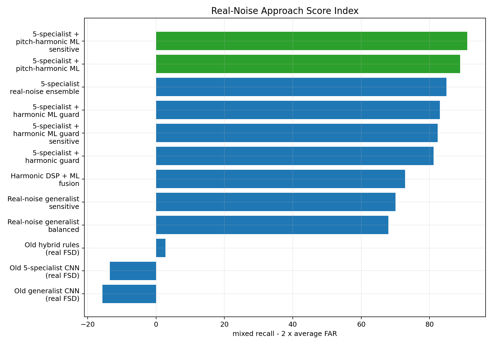

# Acoustic Drone Detection in Real-Noise Environments

## An Engineering White Paper

Date: 2026-05-18  
Project: Passive acoustic drone detection  
Status: research prototype, benchmarked on DADS + FSD50K

## Executive Summary

This project developed a passive acoustic drone detection system and improved it through multiple engineering iterations. The goal was to detect drone sounds while rejecting hard false alarms such as engines, vehicles, tanks, crowds, and other environmental noise.

The most important lesson was that synthetic noise testing was not enough. Early models performed well against synthetic tank and engine sounds, but they failed when tested against real vehicle and engine recordings from FSD50K. This exposed a synthetic-to-real gap.

The current best approach is:

```text
5 specialist CNN detectors
+
harmonic DSP features
+
pretrained pitch-estimator features
+
learned ML fusion
```

This approach achieved the best current benchmark result:

| Metric | Result |
|---|---:|
| clean drone recall | 99.20% |
| mixed drone + real FSD50K noise recall | 91.05% |
| -20 dB mixed recall | 48.40% |
| -15 dB mixed recall | 85.60% |
| -10 dB mixed recall | 98.40% |
| -5 dB mixed recall | 99.20% |
| false alarm rate | 0.00% |

These results are promising, but they are not a final operational claim. The system still needs validation on real FPV drone recordings, real tank/vehicle field audio, and microphone-array recordings.

## Problem

Detecting drones by sound is difficult because many non-drone sounds share similar acoustic structure. Engines, generators, vehicles, and tanks can produce strong harmonic patterns. Crowds, wind, and speech can also confuse detectors.

The project needed a detector that could:

- detect drone audio,
- remain sensitive when drone audio is mixed with real noise,
- reject vehicle and engine false alarms,
- support future microphone-array direction finding,
- remain modular so new guard models and fusion rules can be tested safely.

## Data Used

The project used:

- DADS drone audio for positive drone examples.
- DADS no-drone audio for negative examples.
- FSD50K vehicle/engine clips as real hard negatives.
- Drone + FSD50K mixtures at multiple SNRs.

The FSD50K hard-negative set included labels such as:

- engine,
- vehicle,
- motor vehicle,
- truck,
- car,
- bus,
- motorcycle,
- aircraft,
- explosion,
- gunshot/gunfire.

This real-noise benchmark became the most important test because it exposed weaknesses that synthetic tank/engine tests did not.

## Base Audio Representation

Each audio window is converted into five spectral views:

| View | Description |
|---:|---|
| 1 | raw audio |
| 2 | high-pass 150 Hz |
| 3 | high-pass 250 Hz |
| 4 | band-pass 200-6000 Hz |
| 5 | band-pass 500-6000 Hz |

These views were used in different ways across the project:

- one generalist CNN trained across all views,
- five specialist CNNs, one per view,
- hybrid systems that combine specialist sensitivity with guard models.

## Trial and Error

The project did not succeed in one step. Each iteration revealed a different failure mode.

### 1. Baseline CNN

The first CNN proved that drone audio was learnable from spectrograms. It was useful, but not robust enough against hard false alarms.

How it worked technically:

- Each audio file was loaded as mono 16 kHz audio.
- Audio was sliced into 1-second windows.
- Each window was converted into a 64-bin log-mel spectrogram.
- A small 2D CNN learned a binary classifier: drone vs no-drone.
- Inference used one spectrogram view per window and returned a drone probability.


### 2. One Generalist CNN

A single multi-view CNN was trained using all five spectral views. This model was stable and had lower false alarms, but it was less sensitive under heavy noise.

How it worked technically:

- For each 1-second audio window, five filtered versions were created: raw, high-pass 150 Hz, high-pass 250 Hz, band-pass 200-6000 Hz, and band-pass 500-6000 Hz.
- During training, one random view was selected for each sample. This forced one CNN to learn all preprocessing views.
- During inference, the same CNN was run on all five views.
- The five drone probabilities were combined with fixed weights and a vote/maximum rule.
- This made the model stable, but it also encouraged conservative behavior because one CNN had to cover every view.

The early SNR curve showed the central weakness: performance depended strongly on interference level.


### 3. Five Specialist CNNs

Five CNNs were trained, one for each spectral view. This increased sensitivity, but also made the system more likely to false alarm when one specialist fired incorrectly.

How it worked technically:

- The same five views were used, but each view had its own CNN.
- The raw model only saw raw audio. The HPF-150 model only saw the 150 Hz high-pass view, and so on.
- At inference, all five CNNs produced independent drone probabilities.
- The ensemble combined those probabilities using weighted average, filtered maximum, and vote count.
- Sensitivity improved because each CNN specialized, but a single overconfident specialist could create a false alarm.


### 4. Hybrid Rules

A hybrid system was built:

```text
specialists for sensitivity
+
generalist for confirmation
+
temporal smoothing
```

This worked very well on the original benchmark, especially against synthetic tank and engine sounds.

How it worked technically:

- The five-specialist ensemble acted as the sensitive front end.
- The multi-view generalist CNN acted as a confirmation model.
- A detection could be accepted when specialist evidence was strong enough and/or the generalist also agreed.
- A simple veto rejected some cases where only one specialist fired while the generalist score stayed very low.
- Temporal smoothing required repeated detections across nearby windows, such as 2 out of the last 3 windows.

The timeline plots made the hybrid behavior easier to see than a single accuracy number. Drone-positive windows stayed active, while tank-alone and pure-noise windows were mostly rejected on the original benchmark.


### 5. Synthetic Noise Failure

The system looked strong against synthetic tank and engine sounds, but this did not transfer to real vehicle/engine audio.

When tested on real FSD50K vehicle and engine recordings:

| System | Mixed drone + real-noise recall |
|---|---:|
| old multi-view generalist CNN | 37.03% |
| old five-specialist CNN ensemble | 30.95% |
| old hybrid | 9.32% |

This was the key failure. The detector had learned the synthetic noise distribution, not the real operational nuisance class.

The graph below shows the problem visually. The old hybrid looked strong on the synthetic benchmark and still detected clean drone audio, but it collapsed on drone mixed with real FSD50K vehicle/engine noise.


### 6. Real-Noise Generalist

The next step was to train on real FSD50K hard negatives and drone + FSD50K mixtures. This reduced false alarms, but the detector became too conservative and missed many mixed drone examples.

How it worked technically:

- FSD50K vehicle/engine/noise clips were used as real no-drone hard negatives.
- Positive training examples were created by mixing DADS drone windows with real FSD50K noise at different SNRs.
- The CNN still used the five-view generalist design, but the data recipe became more realistic.
- This taught the model to reject real nuisance audio, but it also made the model hesitant when the drone was weak inside real noise.

### 7. Balanced Real-Noise Training

Several real-noise generalist versions were trained. The sensitive version improved recall but raised false alarms. The balanced version reduced false alarms but lost sensitivity.

This showed that one model alone was not the best structure.

How it worked technically:

- Class balance, drone/no-drone loss weights, and real-noise mixture ratios were adjusted.
- The training set included cleaner drone examples, mixed drone examples, real FSD50K negatives, and DADS no-drone examples.
- Threshold sweeps were used after training because the raw 0.5 threshold was not always the best operating point.
- The best balanced model became useful as a guard, but not as the whole detector.

### 8. Harmonic DSP + ML Fusion

Harmonic features were added:

- low-frequency fundamental estimate,
- harmonicity,
- vehicle-risk score,
- upper harmonic energy ratio.

This helped, but only modestly. The system needed a better way to combine evidence.

How it worked technically:

- The balanced CNN encoder was frozen so the base spectral representation did not drift.
- A harmonic analyzer estimated a low-frequency fundamental and harmonic-ladder structure.
- Eight harmonic features were extracted from each 1-second window.
- The CNN latent vector and harmonic features were fed into a small fusion MLP.
- The waveform was not destructively cleaned; harmonic evidence was used as side information.

The harmonic-fusion plots show why threshold choice mattered. Lower thresholds recovered more drone recall, but the useful operating point had to preserve false-alarm control.


### 9. Five Real-Noise Specialists

The five-specialist idea was retrained with the real-noise data recipe. This restored sensitivity while keeping false alarms low.

How it worked technically:

- Five separate CNNs were trained again, one per spectral view.
- The training data used the real FSD50K recipe rather than synthetic tank/engine noise.
- Each specialist learned its own view under real interference conditions.
- The ensemble output produced per-view probabilities, weighted score, filtered maximum, and vote count.
- These became input features for the final fusion stage instead of being treated as the final decision by themselves.

### 10. Pitch-Harmonic ML Fusion

The final improvement added a pretrained pitch estimator and learned fusion.

The fusion model uses:

- five specialist CNN probabilities,
- specialist ensemble score,
- filtered max,
- vote count,
- harmonic DSP features,
- pretrained pitch/periodicity features,
- a small learned ML model.

This is currently the best approach.

How it worked technically:

- The five real-noise specialists produced five drone probabilities for every window.
- The DSP harmonic extractor measured low-frequency and harmonic-ladder evidence.
- The pretrained pitch estimator added pitch confidence, pitch stability, and low-pitch evidence.
- A small learned fusion model took these features together and output the final drone probability.
- The final operating threshold was selected by benchmark sweep, then temporal smoothing was applied over consecutive windows.

## Current Best Architecture

The best current system is:

```text
audio window
->
five filtered views
->
five specialist CNNs
->
specialist probability features
->
harmonic DSP feature extraction
->
pretrained pitch-estimator feature extraction
->
learned ML fusion
->
drone / no-drone
```

The final decision is learned rather than hand-written. Instead of using only rules such as "if score is above threshold," the model learns how much to trust each signal.

### What Each Component Does

#### Five Specialist CNNs

The system does not rely on one CNN looking at one version of the audio. Instead, it creates five filtered versions of the same 1-second audio window and sends each one to a specialist CNN.

Each specialist focuses on a different acoustic view:

| Specialist | What it listens for |
|---|---|
| raw audio | the full signal without filtering |
| high-pass 150 Hz | drone evidence after removing very low rumble |
| high-pass 250 Hz | stronger removal of engine/tank low-frequency energy |
| band-pass 200-6000 Hz | the main drone-relevant band |
| band-pass 500-6000 Hz | higher-frequency motor/propeller evidence with less low-end clutter |

Why it helps:

Different noise sources hide the drone in different frequency regions. A single model can become too conservative. The specialist design gives the system multiple chances to detect drone evidence.

#### Harmonic DSP Features

Engines, vehicles, tanks, and generators often have strong harmonic structure. The harmonic DSP stage measures that structure directly.


It estimates:

- a low-frequency fundamental frequency,
- how harmonic the sound is,
- how much upper-band energy follows a harmonic ladder,
- a vehicle-risk score.

Why it helps:

Drone audio can also be harmonic, so harmonic structure alone is not enough. But when a sound has strong low-frequency engine-like periodicity, this feature helps the system avoid false alarms.

#### Pretrained Pitch Estimator

The pretrained pitch estimator adds another view of periodicity. In this project, CREPE is used to estimate pitch and pitch confidence over the audio window.

It provides features such as:

- median estimated pitch,
- pitch stability,
- periodicity confidence,
- low-pitch ratio.

Why it helps:

The DSP harmonic analyzer is hand-designed. The pretrained pitch estimator is learned from a larger external signal-processing task. It gives the fusion model a second opinion about whether the sound contains stable pitch-like structure.

#### Learned ML Fusion

The final stage is a small machine-learning model. It receives all the evidence together:

- five specialist CNN probabilities,
- specialist weighted score,
- specialist filtered maximum,
- specialist vote count,
- harmonic DSP features,
- pretrained pitch features.

It learns the final decision:

```text
all evidence -> drone / no-drone
```

Why it helps:

Earlier versions used hand-written rules. Hand rules are useful, but they are brittle. Learned fusion can discover combinations such as:

- high specialist confidence with low vehicle-risk means likely drone,
- one hot specialist plus strong low-frequency vehicle pitch means likely false alarm,
- moderate specialist score plus stable drone-like evidence may still be a detection.

This is why the current best approach is not just "five CNNs" or just "harmonics." The best result comes from combining all signals and learning how to weigh them.

### Training and Evaluation Settings

The current best system was built in stages. Each stage was saved separately so older models were not overwritten.

#### Audio Settings

| Setting | Value |
|---|---:|
| sample rate | 16,000 Hz |
| window length | 1 second |
| hop length used in many evaluations | 0.5 second |
| spectrogram type | log-mel |
| mel bins | 64 |
| binary labels | drone / no-drone |

#### Real-Noise Data Recipe

Training used:

- DADS drone clips as positive drone audio.
- DADS no-drone clips as negative audio.
- FSD50K vehicle/engine clips as real hard negatives.
- Drone + FSD50K mixtures as positive mixed examples.

The mixed examples used SNR levels:

```text
-20, -15, -10, -5, 0, +5, +10 dB
```

#### Five-Specialist CNN Training

Each specialist was trained on one fixed view only.

| Setting | Value |
|---|---:|
| number of specialists | 5 |
| epochs requested | 24 |
| batch size | 32 |
| optimizer learning rate | 0.001 |
| data-loader workers | 0 |
| PyTorch CPU threads | 3 |
| train examples per class | 6,000 |
| validation examples per class | 1,200 |
| max DADS drone files | 12,000 |
| max DADS no-drone files | 5,000 |
| max FSD50K clips per label | 500 |
| positive mix probability | 0.95 |
| validation positive mix probability | 1.00 |
| negative FSD probability | 0.95 |
| drone loss weight | 1.45 |
| no-drone loss weight | 1.00 |
| early-stopping patience | 8 epochs |

Best validation accuracy by specialist:

| Specialist | Best validation accuracy |
|---|---:|
| raw | 89.92% |
| high-pass 150 Hz | 90.17% |
| high-pass 250 Hz | 91.29% |
| band-pass 200-6000 Hz | 86.79% |
| band-pass 500-6000 Hz | 86.92% |

The five-specialist ensemble was saved as:

```text
models/phase3_real_noise_specialists/drone_cnn_phase3_real_noise_specialist_ensemble.pth
```

#### Harmonic DSP + ML Fusion Training

The harmonic fusion model used the balanced real-noise generalist as a frozen backbone. It did not retrain the CNN backbone.

| Setting | Value |
|---|---:|
| frozen CNN latent size | 64 |
| harmonic feature count | 8 |
| fusion input size | 72 |
| fusion model | small MLP |
| best validation accuracy | 88.50% |

It was saved as:

```text
models/phase2_harmonic_fusion/drone_cnn_phase2_harmonic_fusion_v1.pth
```

#### Pitch-Harmonic ML Fusion Training

The final learned fusion model used feature-level inputs rather than raw audio.

Input features:

- five specialist CNN probabilities,
- specialist weighted score,
- specialist filtered max,
- specialist vote count,
- harmonic fusion score,
- harmonic vehicle-risk score,
- harmonic f0 and harmonicity,
- CREPE pitch and periodicity features.

| Setting | Value |
|---|---:|
| feature count | 19 |
| model | small MLP |
| training examples per class | 1,200 |
| epochs requested | 30 |
| early stopped at | 24 epochs |
| batch size | 256 |
| learning rate | 0.001 |
| best validation accuracy | 91.25% |

It was saved as:

```text
models/phase2b_pitch_guard/drone_cnn_phase2b_learned_pitch_guard_v1_medium.pth
```

#### Final Benchmark Setting

The best reported operating point used:

| Setting | Value |
|---|---:|
| pitch-harmonic ML threshold | 0.45 |
| temporal smoothing | 2 out of last 3 windows |
| benchmark windows per condition | 250 |
| negative benchmark | FSD50K real noise + DADS no-drone |

This produced:

```text
mixed recall: 91.05%
false alarm rate: 0.00%
```

## Benchmark Results

### Real-Noise Approach Comparison


### Score Index

The score index is a simple engineering ranking:

```text
mixed recall - 2 x average false-alarm rate
```



### Recall by SNR

This graph shows where the system still struggles. Very low SNR, especially -20 dB, remains difficult.


### Synthetic vs Real-Noise Progress

This graph shows why the synthetic benchmark was misleading and how the later real-noise-trained systems recovered performance.


## Best Current Result

Current best approach:

```text
5-specialist CNN
+
harmonic DSP
+
pretrained pitch estimator
+
learned ML fusion
```

Best operating threshold:

```text
0.45
```

Benchmark result:

| Condition | Recall / false alarm |
|---|---:|
| clean drone | 99.20% |
| drone + FSD50K at -20 dB | 48.40% |
| drone + FSD50K at -15 dB | 85.60% |
| drone + FSD50K at -10 dB | 98.40% |
| drone + FSD50K at -5 dB | 99.20% |
| overall mixed recall | 91.05% |
| false alarm rate | 0.00% |

## Engineering Lessons

### Synthetic tests can mislead

Synthetic noise is useful for early development, but it cannot prove real-world robustness.

### A single CNN is not enough

The best system uses different components for different roles:

- specialists for sensitivity,
- harmonic features for vehicle/engine structure,
- pitch features for periodicity,
- learned fusion for final decision.

### Learned fusion beats hand rules

Hand-written fusion rules were useful, but the best result came from allowing a small ML model to learn how to combine all evidence.

### Low-SNR detection remains hard

The system performs well at -15 dB and above, but -20 dB remains difficult.

### Real mission data is still required

The current benchmark uses DADS and FSD50K. It is stronger than synthetic testing, but still not the same as real FPV battlefield audio.

## Limitations

The current system has not yet been validated on:

- real FPV drone recordings,
- real tank battlefield recordings,
- real microphone-array recordings,
- 48 kHz high-frequency FPV audio,
- live embedded hardware.

The current audio pipeline runs at 16 kHz, which limits analysis to frequencies below approximately 8 kHz. High-pitch FPV signatures above this range require a future 48 kHz phase.

## Recommended Next Work

1. Validate the best system on real FPV drone recordings.
2. Collect real local false-alarm audio.
3. Test real tank/vehicle recordings if available.
4. Integrate the best learned fusion model into the live detector.
5. Revisit microphone-array beamforming after the detector is stable.
6. Extend to 48 kHz when real high-frequency FPV data is available.

## Conclusion

The project evolved from a basic CNN detector into a multi-component acoustic detection system. The main breakthrough was recognizing that synthetic tank and engine tests were not enough. Real FSD50K noise forced the model design to become more realistic.

The current best approach is:

```text
5-specialist CNN + harmonic DSP + pretrained pitch estimator + learned ML fusion
```

This approach currently provides the best balance of sensitivity and false-alarm control on the DADS + FSD50K benchmark.

The system is now ready for the next stage: validation against real FPV and field audio.
