# Trial And Error Story

This project did not become good in one clean jump. The useful part was the iteration: each detector exposed a different weakness, and each failure forced a better design.

The current best direction is:

```text
Guard-Neck Mid Fusion v2
```

That means:

```text
five specialist CNN encoders
+ harmonic / vehicle guard features
+ learned fusion at the network neck
```

It was not the first idea. It came after several late-fusion systems showed both their value and their limits.

## Problem

The task is to detect drone audio while rejecting difficult non-drone sounds:

- engines,
- vehicles,
- tanks,
- generators,
- crowds,
- wind,
- speech,
- general environmental noise.

Clean drone detection was not the real challenge. The hard part was:

```text
detect weak drones mixed with real noise
without triggering on vehicles and engines
```

## Iteration Summary

| Step | Approach | What happened | Lesson |
|---|---|---|---|
| 1 | Basic CNN | Learned drone/no-drone from log-mel spectrograms | Clean accuracy was not enough |
| 2 | Multi-view generalist CNN | One CNN learned five filtered views | Stable, but missed weak drones |
| 3 | Five specialist CNNs | One CNN per filtered view | More sensitive, but easier to false alarm |
| 4 | Rule-based hybrid | Specialists + generalist + smoothing | Excellent on synthetic benchmark |
| 5 | Real FSD50K benchmark | Old systems collapsed on real mixed noise | Synthetic noise was misleading |
| 6 | Real-noise generalist | Trained with real hard negatives | Low false alarms, poor mixed recall |
| 7 | Harmonic DSP fusion | Added vehicle harmonic features | Helpful, but hard guard logic was risky |
| 8 | Pitch-harmonic learned fusion | Added pretrained periodicity evidence | Stronger learned late fusion |
| 9 | Real-noise specialists | Rebuilt the specialists using FSD50K recipe | Sensitivity returned |
| 10 | Raw vs five-specialist ablation | Raw was surprisingly strong | Specialists help most as evidence, not as votes |
| 11 | Mid Fusion v1 | Joined internal CNN latents before decision | Better than pure rule fusion |
| 12 | Hard/soft guard comparison | Hard guard reduced FAR but hurt recall | Guard evidence should be soft |
| 13 | Guard-Neck Mid Fusion v2 | Injected guard features where CNN branches meet | Best balanced result so far |

## Step 1: Basic CNN

The first detector was a simple CNN on log-mel spectrograms.

```text
audio window
-> log-mel spectrogram
-> CNN
-> drone / no-drone
```

This proved that drone audio could be learned, but it was not robust enough. A clean test score did not mean the detector could survive engines, vehicles, or crowd noise.

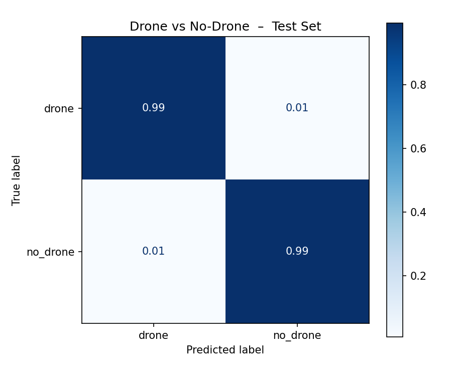

The follow-up baseline improved the first model but was still a conventional single-view detector:

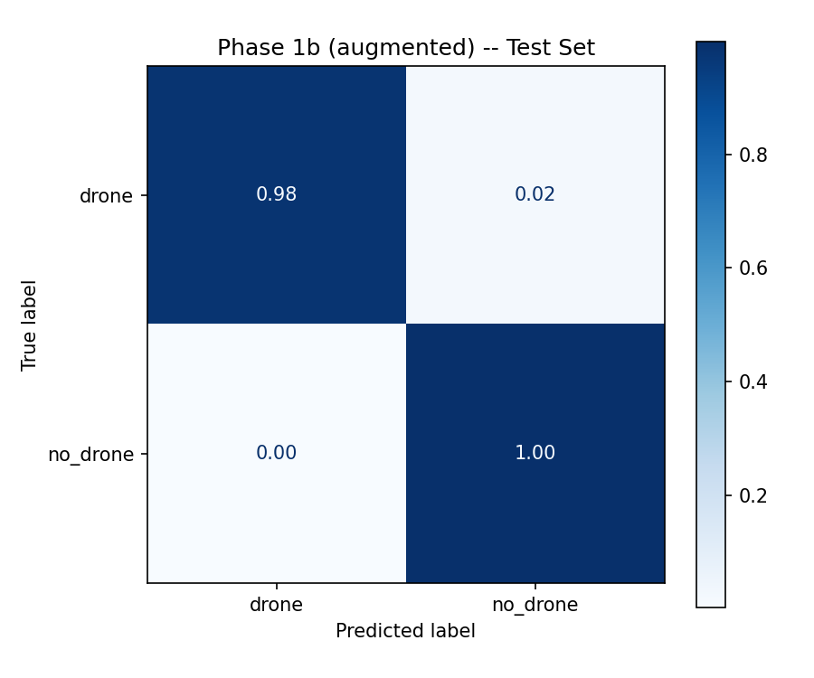

Lesson:

```text
basic CNN detection works, but hard negatives decide whether it is useful
```

## Step 2: Multi-View Generalist CNN

The next idea was to show the same audio through multiple frequency views:

```text
raw
high-pass 150 Hz
high-pass 250 Hz
band-pass 200-6000 Hz
band-pass 500-6000 Hz
```

One CNN was trained across all views. During training it saw random filtered versions. During inference it ran on all five views and combined the scores.

What improved:

- false alarms became lower,
- the model became more stable,
- filtered views helped reduce low-frequency clutter.

What failed:

- one generalist CNN became conservative,
- weak drones under real noise were still missed.

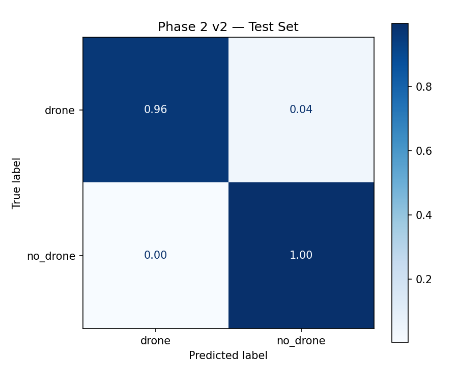

The early SNR curve already showed that noise level was the real problem:

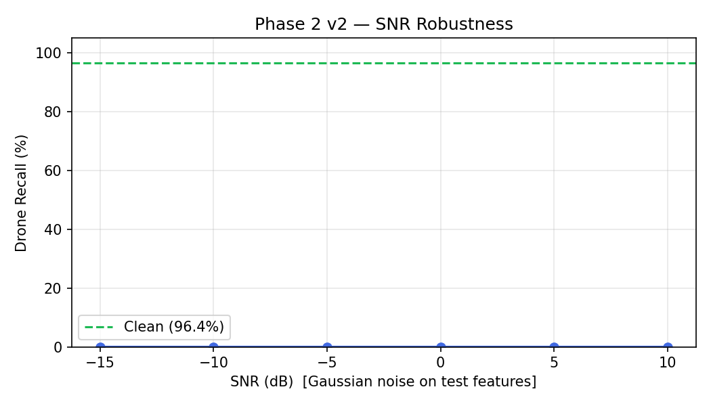

Lesson:

```text
one model can be stable, but stability can cost sensitivity
```

## Step 3: Five Specialist CNNs

The next idea was to train five separate CNNs:

| Specialist | Input |
|---|---|
| raw specialist | raw audio |
| HPF-150 specialist | high-pass 150 Hz |
| HPF-250 specialist | high-pass 250 Hz |
| BPF-200-6000 specialist | band-pass 200-6000 Hz |
| BPF-500-6000 specialist | band-pass 500-6000 Hz |

This made the system more sensitive because each model specialized in one spectral view.

What improved:

- better weak-drone sensitivity,
- different views could catch different drone cues,
- failures became easier to inspect per view.

What failed:

- if one specialist fired incorrectly, the system could false alarm,
- specialist sensitivity needed confirmation.

Lesson:

```text
specialists are good at finding weak evidence, but they need smart fusion
```

## Step 4: Rule-Based Hybrid

The project then combined:

```text
five-specialist CNNs
+ multi-view generalist CNN
+ hand-written fusion rules
+ simple veto
+ temporal smoothing
```

This was late fusion. Each model produced a probability first, then rules combined those probabilities.

That was useful because it was easy to debug. The system could say:

```text
specialist score high
generalist score low
vehicle veto active
```

The early hybrid looked excellent on synthetic tests.

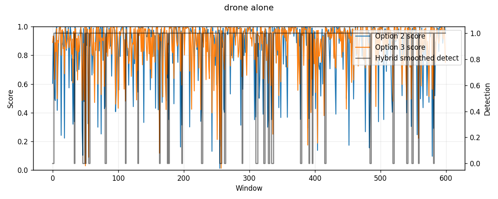

It also looked good when the drone was mixed with tank-like noise:

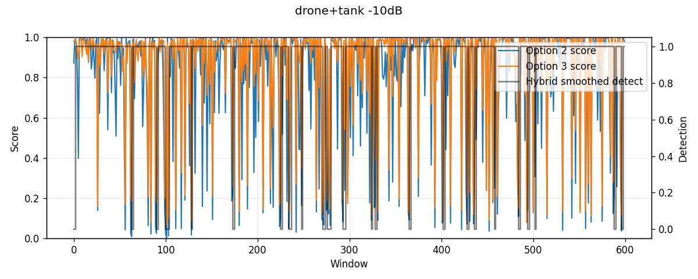

At very low SNR, the timeline showed how hard the problem could become:

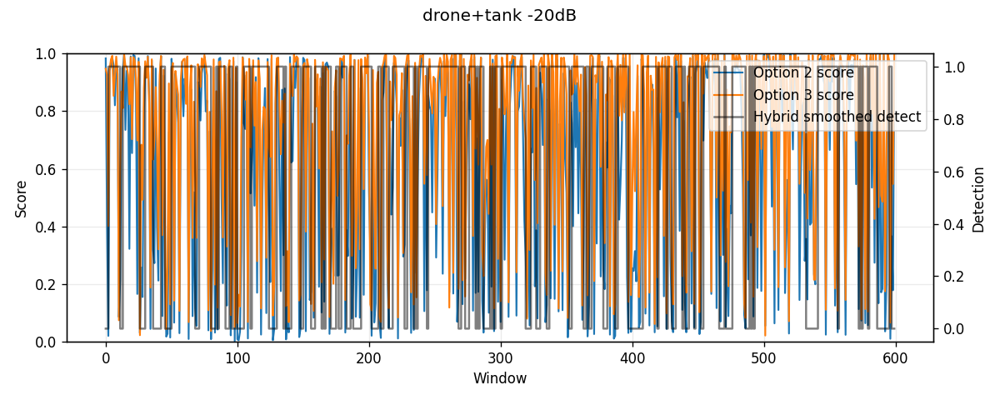

The no-drone timelines were why this version looked promising:

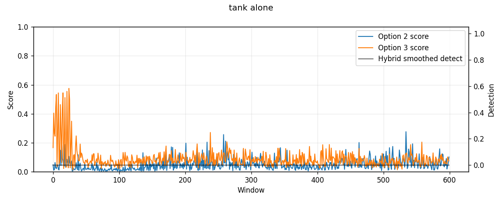

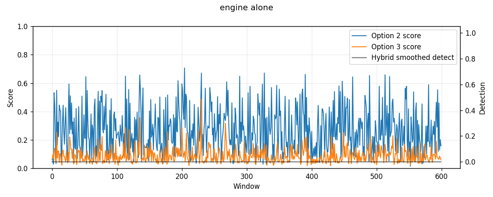

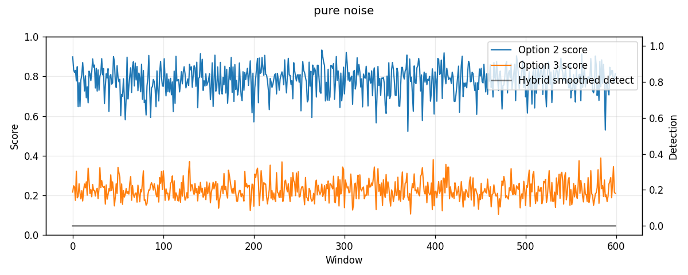

Lesson at the time:

```text
late fusion was the right debugging tool
```

But the benchmark was still not realistic enough.

## Step 5: The Synthetic Noise Downfall

This was the turning point.

The old hybrid looked strong against synthetic tank and engine sounds. But when tested with real FSD50K vehicle and engine recordings, performance collapsed.

| System | Mixed drone + real-noise recall |
|---|---:|
| Old multi-view generalist CNN | 37.03% |
| Old five-specialist CNN ensemble | 30.95% |
| Old hybrid | 9.32% |


Why this mattered:

- synthetic tank/engine noise was too simple,
- the model learned the synthetic distribution,
- rejecting synthetic noise did not prove real-world robustness,
- the hybrid became too conservative when real vehicle noise was mixed with drone audio.

Main lesson:

```text
synthetic hard negatives are useful for prototyping, but real hard negatives are required for trust
```

## Step 6: Real-Noise Generalist

The next model was trained with:

- DADS drone audio,
- DADS no-drone audio,
- FSD50K real vehicle/engine hard negatives,
- drone + FSD50K noise mixtures.

What improved:

- false alarms dropped,
- real nuisance audio was handled better.

What failed:

- the model became too conservative,
- it rejected many drone + real-noise mixtures.

Lesson:

```text
false-alarm control can destroy recall if the model becomes too cautious
```

## Step 7: Harmonic DSP Fusion

Engines, vehicles, tanks, and generators often create harmonic ladders:

```text
f0, 2f0, 3f0, 4f0...
```

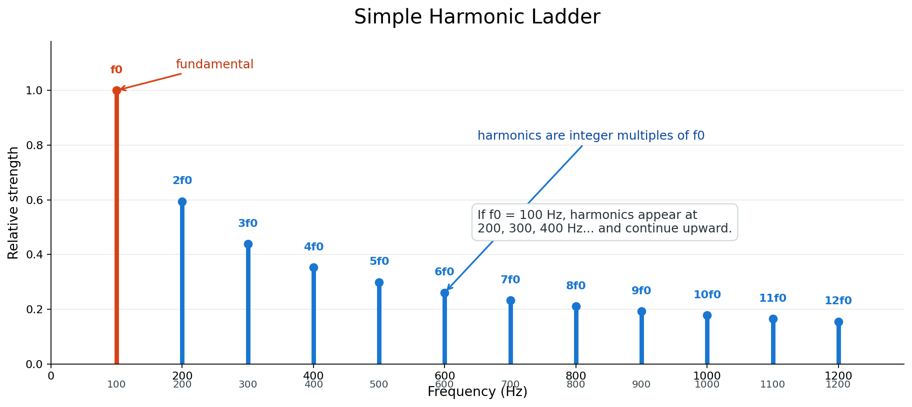

The project added harmonic DSP features:

- low-frequency fundamental estimate,
- harmonicity,
- low-band energy,
- upper harmonic structure,
- vehicle-risk score.

Important design choice:

```text
do not delete audio before the CNN
```

Instead, harmonic evidence was passed as side-channel features to a fusion model.

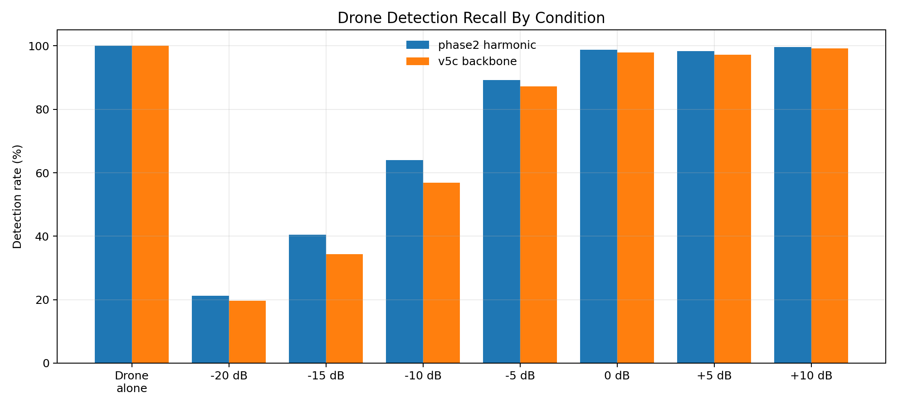

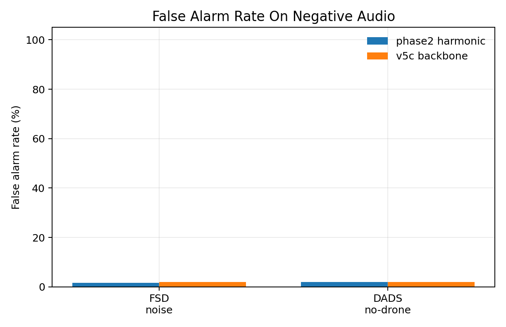

Threshold choice became important:


The detailed sweep showed how different thresholds affected low-SNR recall and false alarms:

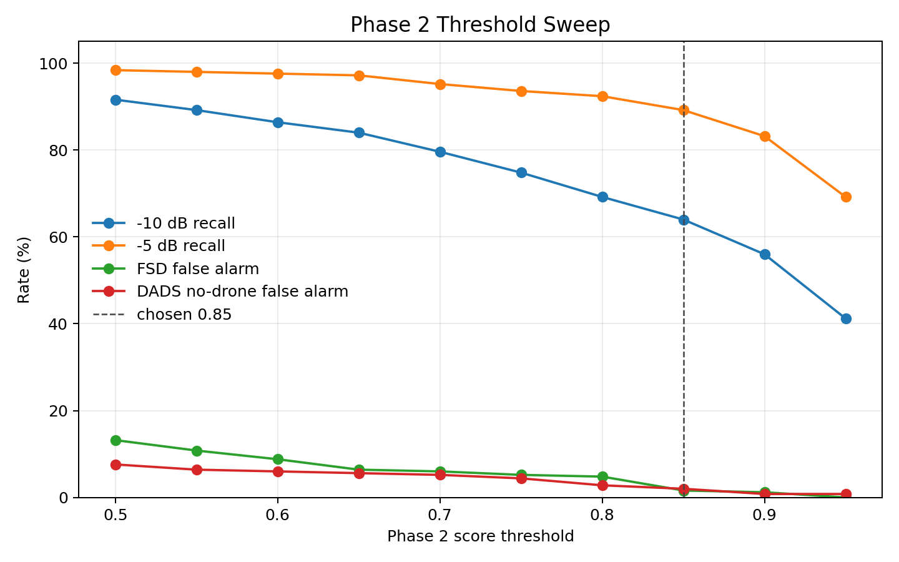

Score distributions helped show how the fusion model separated conditions:

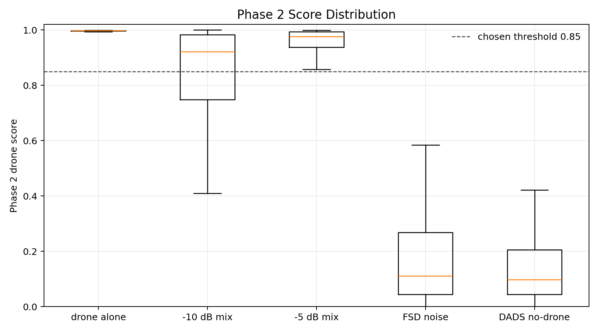

Lesson:

```text
harmonic features help, but they should guide fusion, not directly erase sound
```

## Step 8: Pitch-Harmonic Learned Fusion

A pretrained pitch / periodicity estimator was added.

The fusion model received:

- five specialist CNN probabilities,
- specialist weighted score,
- filtered maximum,
- vote count,
- harmonic DSP features,
- pretrained pitch features.

Instead of a fixed rule, it learned how to combine evidence.

This was a strong late-fusion system, and it showed that the guard should be learned rather than purely hand-written.

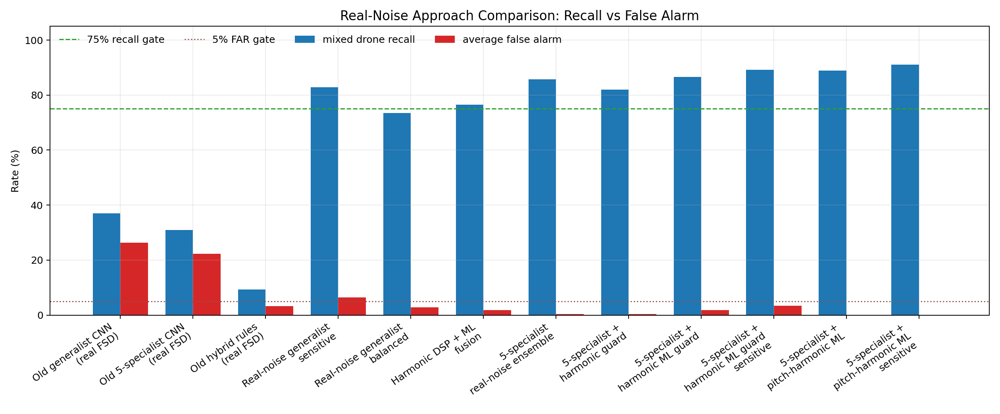


SNR behavior still showed the remaining weakness:

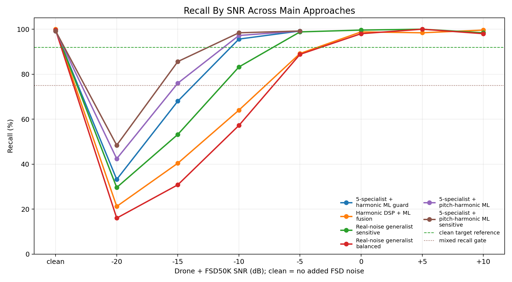

Lesson:

```text
learned late fusion is better than rules, but it still sees mostly final scores
```

## Step 9: Raw Vs Five-Specialist Ablation

A later ablation tested whether five specialists really helped compared with only the raw specialist.

The result was subtle:

- raw-only was surprisingly competitive,
- five weighted specialists reduced false alarms,
- the five-specialist rule was clean but conservative.

This changed how the specialists were interpreted.

They were not magic voters. They were useful feature extractors.

Lesson:

```text
five specialists are most useful as evidence for a learned fusion model
```

## Step 10: Why We Started The Mid-Fusion Philosophy

Late fusion combines outputs after each model has already compressed the audio into a probability:

```text
p_raw, p_hpf150, p_hpf250, p_bpf200, p_bpf500
-> rules or small MLP
-> decision
```

That loses information. A probability says "how drone-like," but not much about why.

Mid fusion keeps the internal feature vectors:

```text
raw encoder latent
hpf150 encoder latent
hpf250 encoder latent
bpf200 encoder latent
bpf500 encoder latent
-> concatenate
-> learned fusion head
```

The philosophy was:

```text
let each specialist describe what it sees,
then let a learned neck decide how those descriptions interact
```

This is especially important for drones because drone and vehicle audio can both be harmonic. A hard harmonic veto can reject real drones. Mid fusion lets the model learn when harmonic evidence means "vehicle" and when it is still compatible with "drone."

## Step 11: Mid Fusion v1

Mid Fusion v1 stripped off the final classifier layer from each specialist and used the internal encoder output:

```text
5 specialists x 64 latent features = 320-dim vector
320-dim vector -> MLP classifier
```

This was the first shift from late fusion to mid fusion.

It improved the direction, but the harmonic/vehicle guard was still outside the neck.

Lesson:

```text
internal CNN features are better than final probabilities alone
```

## Step 12: Hard Guard Vs Soft Guard

The harmonic/vehicle guard was tested in two styles:

| Guard | Behavior | Result |
|---|---|---|
| Hard guard | Can reject detections directly | Lowest false alarms, but weak-drone recall suffered |
| Soft guard | Vehicle risk becomes a penalty | Better recall, but more false alarms |

The key failure was clear:

```text
vehicle-like harmonic evidence is not always non-drone evidence
```

Drones also have motor and propeller harmonics. So the guard should not be a final authority.

Lesson:

```text
guard evidence belongs inside the learned fusion layer
```

## Step 13: Guard-Neck Mid Fusion v2

This is the current best direction.

Guard-Neck v2 injects the guard features directly where the five CNN branches meet.

```text
5 specialist CNN latents: 5 x 64 = 320
+ phase2_guard_score
+ vehicle_risk_score
+ f0_norm
+ harmonicity_score
= 324-dim neck vector
-> MLP classifier
```

This keeps the strengths of the earlier systems:

- specialists provide sensitivity,
- harmonic DSP provides interpretable vehicle-risk evidence,
- the fusion head learns how much to trust each signal,
- the guard is no longer a hard veto.

Best tuned operating point:

```text
threshold = 0.55
```

| System | Recall | FAR | Precision | F1 |
|---|---:|---:|---:|---:|
| Mid Fusion v1 | 88.25% | 0.46% | 99.49% | 93.53% |
| Guard-Neck v2 tuned | 90.10% | 0.31% | 99.67% | 94.64% |
| Guard-Neck v2 sensitive | 95.15% | 2.94% | 97.09% | 96.11% |
| Five-specialist rule | 85.35% | 0.36% | 99.59% | 91.92% |
| Hard guard | 81.90% | 0.21% | 99.76% | 89.95% |
| Soft guard | 86.55% | 0.88% | 99.03% | 92.37% |

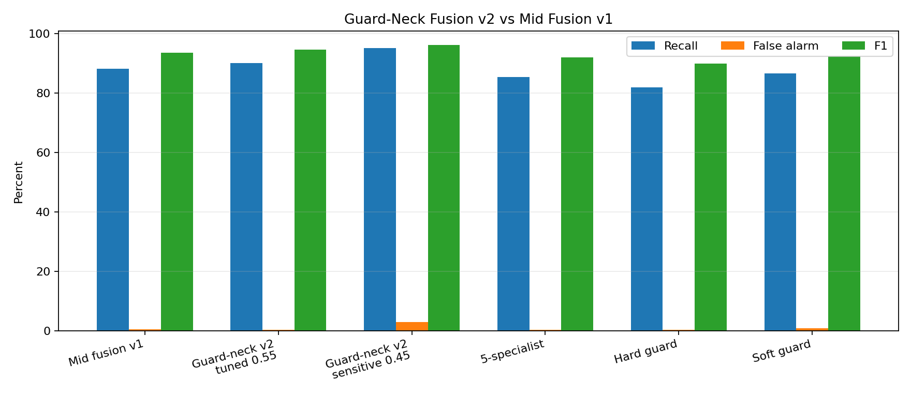

The largest gain was at very difficult SNRs:

| Condition | Mid Fusion v1 | Guard-Neck v2 tuned |
|---|---:|---:|
| Drone alone | 99.2% | 99.2% |
| Drone + FSD -20 dB | 36.0% | 47.6% |
| Drone + FSD -15 dB | 77.2% | 80.4% |
| Drone + FSD -10 dB | 97.6% | 96.8% |
| Drone + FSD -5 dB | 98.4% | 99.2% |

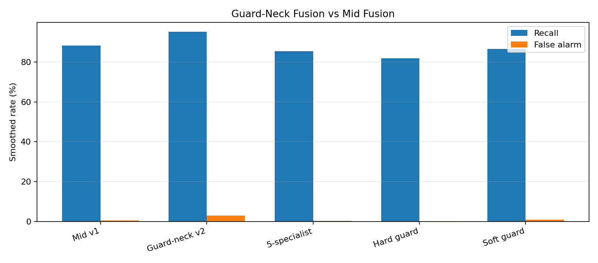

Lesson:

```text
the guard is most useful when it is part of the learned neck,
not when it is a separate rule after the fact
```

## Current Engineering Lesson

The main lesson was not "use a bigger CNN."

The main lesson was:

```text
build the benchmark correctly,
then move evidence to the layer where the model can use it best
```

The current best approach works better because each component has a job:

| Component | Job |
|---|---|
| Five specialist CNN encoders | Extract view-specific drone evidence |
| Harmonic DSP features | Expose engine/vehicle periodic structure |
| Guard-neck fusion | Learn how CNN evidence and guard evidence interact |
| Temporal smoothing | Reduce one-window spikes |

## Current Limitations

The system is still a research prototype.

It still needs:

- real FPV drone recordings,
- real tank / vehicle field recordings,
- real microphone-array recordings,
- 48 kHz high-frequency drone testing,
- deployment testing on live hardware.

## Best Current Summary

```text
Guard-Neck Mid Fusion v2
```

Best tuned benchmark:

```text
90.10% positive recall
0.31% false alarm rate
99.67% precision
94.64% F1
```

This is the best current project direction, but not yet a final operational detector.
